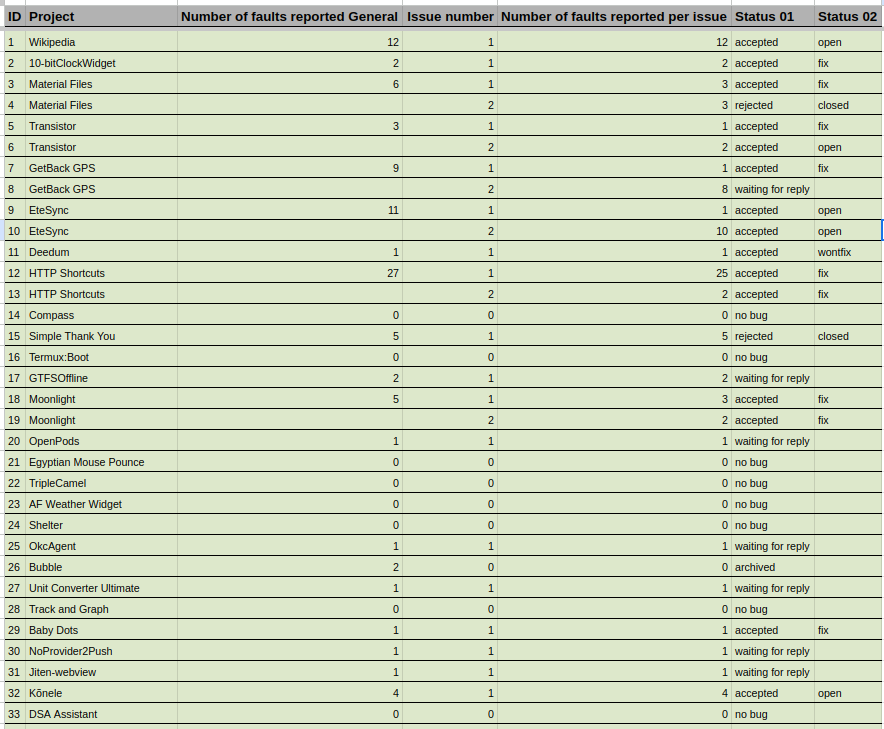
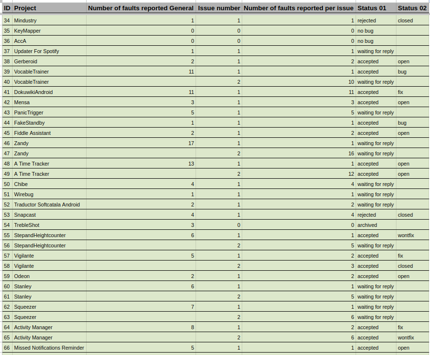
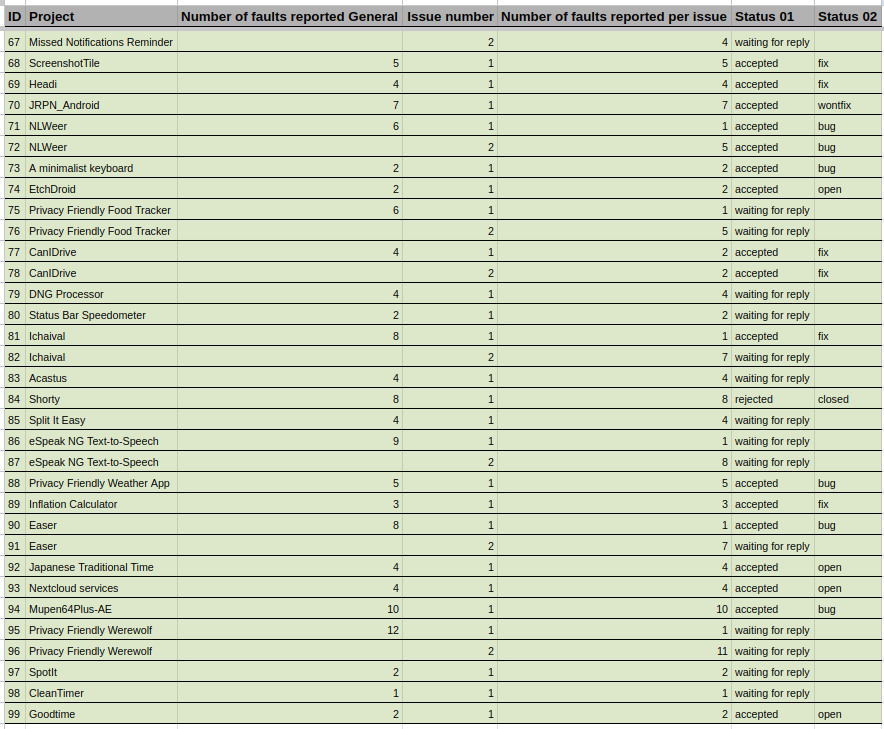

# Evaluation

## Dataloss Detected
```shell
dataloss_analysis
.
├── Dataloss amirz.dngprocessor_5
├── Dataloss android.jonas.fakestandby_7
├── Dataloss at.tacticaldevc.panictrigger_10
├── Dataloss ca.snoe.deedum_16
├── Dataloss ch.famoser.mensa_15
├── Dataloss ch.rmy.android.http_shortcuts_1102120001
├── Dataloss ch.rmy.android.statusbar_tacho_2003030000
├── Dataloss com.activitymanager_413
├── Dataloss com.app.missednotificationsreminder_2010605222
├── Dataloss com.apps.adrcotfas.goodtime_131
├── Dataloss com.aragaer.jtt_36
├── Dataloss com.bobek.compass_5
├── Dataloss com.crazylegend.vigilante_16
├── Dataloss com.dosse.airpods_18
├── Dataloss com.dozingcatsoftware.mouse_pounce_5
├── Dataloss com.ebaschiera.triplecamel_14
├── Dataloss com.etesync.syncadapter_20204
├── Dataloss com.fabienli.dokuwiki_62
├── Dataloss com.genonbeta.TrebleShot_104
├── Dataloss com.gimranov.zandy.app_1461
├── Dataloss com.github.ashutoshgngwr.tenbitclockwidget_201
├── Dataloss com.github.cvzi.screenshottile_51
├── Dataloss com.github.gschwind.fiddle_assistant_110
├── Dataloss com.github.ruleant.getback_gps_70
├── Dataloss com.github.sryze.wirebug_101
├── Dataloss com.headi.app_1109
├── Dataloss com.jmstudios.chibe_4
├── Dataloss com.jovial.jrpn_9
├── Dataloss com.limelight_271
├── Dataloss com.markuspage.android.atimetracker_5102
├── Dataloss com.mzhang.cleantimer_1
├── Dataloss com.nishantboro.splititeasy_1
├── Dataloss com.nkanaev.comics_7
├── Dataloss com.physphil.android.unitconverterultimate_50700
├── Dataloss com.polar.nextcloudservices_10
├── Dataloss com.reecedunn.espeak_20
├── Dataloss com.rohit2810.spotit_2
├── Dataloss com.samco.trackandgraph_200004
├── Dataloss com.serwylo.babydots_10600
├── Dataloss com.simplemobiletools.thankyou_20
├── Dataloss com.termux.boot_7
├── Dataloss com.utazukin.ichaival_24
├── Dataloss com.vaudibert.canidrive_17
├── Dataloss com.wbrenna.gtfsoffline_10
├── Dataloss de.badaix.snapcast_2400
├── Dataloss dev.obfusk.jiten_webview_202108010_repetido
├── Dataloss ee.ioc.phon.android.speak_1800
├── Dataloss eu.depau.etchdroid_12
├── Dataloss eu.roggstar.luigithehunter.dsaassistent_58
├── Dataloss foss.cnugteren.nlweer_11
├── Dataloss fr.corenting.convertisseureurofranc_18
├── Dataloss fr.nihilus.music_201010
├── Dataloss fr.xgouchet.packageexplorer_19
├── Dataloss grmpl.mk.stepandheightcounter_8
├── Dataloss io.anuke.mindustry_104
├── Dataloss io.github.dkter.aaaaa_4
├── Dataloss io.github.sds100.keymapper_49
├── Dataloss mattecarra.accapp_39
├── Dataloss me.zhanghai.android.files_25
├── Dataloss name.gdr.acastus_photon_25
├── Dataloss net.gitsaibot.af_5
├── Dataloss net.typeblog.shelter_17
├── Dataloss org.billthefarmer.shorty_114
├── Dataloss org.ddosolitary.okcagent_6
├── Dataloss org.mupen64plusae.v3.alpha_246
├── Dataloss org.secuso.privacyfriendlycardgameone_2
├── Dataloss org.secuso.privacyfriendlyfoodtracker_4
├── Dataloss org.secuso.privacyfriendlyweather_14
├── Dataloss org.softcatala.traductor_39
├── Dataloss org.unifiedpush.distributor.noprovider2push_7
├── Dataloss org.wikipedia_50374
├── Dataloss org.y20k.transistor_87
├── Dataloss ru.ra66it.updaterforspotify_21
├── Dataloss ryey.easer_125
├── Dataloss se.pp.mc.android.Gerberoid_10000
├── Dataloss uk.org.ngo.squeezer_104
└── vocabletrainer.heinecke.aron.vocabletrainer_22

```
## Classification of Reports

```shell
classification_of_reports
.
├── amirz.dngprocessor_5.xlsx
├── android.jonas.fakestandby_7.xlsx
├── at.tacticaldevc.panictrigger_10.xlsx
├── ca.snoe.deedum_16.xlsx
├── ch.famoser.mensa_15.xlsx
├── ch.rmy.android.http_shortcuts_1102120001.xlsx
├── ch.rmy.android.statusbar_tacho_2003030000.xlsx
├── com.activitymanager_413.xlsx
├── com.app.missednotificationsreminder_2010605222.xlsx
├── com.apps.adrcotfas.goodtime_131.xlsx
├── com.aragaer.jtt_36.xlsx
├── com.bobek.compass_5.xlsx
├── com.crazylegend.vigilante_16.xlsx
├── com.dosse.airpods_18.xlsx
├── com.dozingcatsoftware.mouse_pounce_5.xlsx
├── com.ebaschiera.triplecamel_14.xlsx
├── com.etesync.syncadapter_20204.xlsx
├── com.fabienli.dokuwiki_62.xlsx
├── com.genonbeta.TrebleShot_104.xlsx
├── com.gimranov.zandy.app_1461.xlsx
├── com.github.ashutoshgngwr.tenbitclockwidget_201.xlsx
├── com.github.cvzi.screenshottile_51.xlsx
├── com.github.gschwind.fiddle_assistant_110.xlsx
├── com.github.ruleant.getback_gps_70.xlsx
├── com.github.sryze.wirebug_101.xlsx
├── com.headi.app_1109.xlsx
├── com.jmstudios.chibe_4.xlsx
├── com.jovial.jrpn_9.xlsx
├── com.limelight_271.xlsx
├── com.markuspage.android.atimetracker_5102.xlsx
├── com.mzhang.cleantimer_1.xlsx
├── com.nishantboro.splititeasy_1.xlsx
├── com.nkanaev.comics_7.xlsx
├── com.physphil.android.unitconverterultimate_50700.xlsx
├── com.polar.nextcloudservices_10.xlsx
├── com.reecedunn.espeak_20.xlsx
├── com.rohit2810.spotit_2.xlsx
├── com.samco.trackandgraph_200004.xlsx
├── com.serwylo.babydots_10600.xlsx
├── com.simplemobiletools.thankyou_20.xlsx
├── com.termux.boot_7.xlsx
├── com.utazukin.ichaival_24.xlsx
├── com.vaudibert.canidrive_17.xlsx
├── com.wbrenna.gtfsoffline_10.xlsx
├── de.badaix.snapcast_2400.xlsx
├── dev.obfusk.jiten_webview_202108010_repetido.xlsx
├── ee.ioc.phon.android.speak_1800.xlsx
├── eu.depau.etchdroid_12.xlsx
├── eu.roggstar.luigithehunter.dsaassistent_58.xlsx
├── foss.cnugteren.nlweer_11.xlsx
├── fr.corenting.convertisseureurofranc_18.xlsx
├── fr.nihilus.music_201010.xlsx
├── fr.xgouchet.packageexplorer_19.xlsx
├── grmpl.mk.stepandheightcounter_8.xlsx
├── io.anuke.mindustry_104.xlsx
├── io.github.dkter.aaaaa_4.xlsx
├── io.github.sds100.keymapper_49.xlsx
├── mattecarra.accapp_39.xlsx
├── me.zhanghai.android.files_25.xlsx
├── name.gdr.acastus_photon_25.xlsx
├── net.gitsaibot.af_5.xlsx
├── net.typeblog.shelter_17.xlsx
├── org.billthefarmer.shorty_114.xlsx
├── org.ddosolitary.okcagent_6.xlsx
├── org.mupen64plusae.v3.alpha_246.xlsx
├── org.secuso.privacyfriendlycardgameone_2.xlsx
├── org.secuso.privacyfriendlyfoodtracker_4.xlsx
├── org.secuso.privacyfriendlyweather_14.xlsx
├── org.softcatala.traductor_39.xlsx
├── org.unifiedpush.distributor.noprovider2push_7.xlsx
├── org.wikipedia_50374.xlsx
├── org.y20k.transistor_87.xlsx
├── ru.ra66it.updaterforspotify_21.xlsx
├── ryey.easer_125.xlsx
├── se.pp.mc.android.Gerberoid_10000.xlsx
├── uk.org.ngo.squeezer_104.xlsx
└── vocabletrainer.heinecke.aron.vocabletrainer_22.xlsx

```

## Reported Issues



